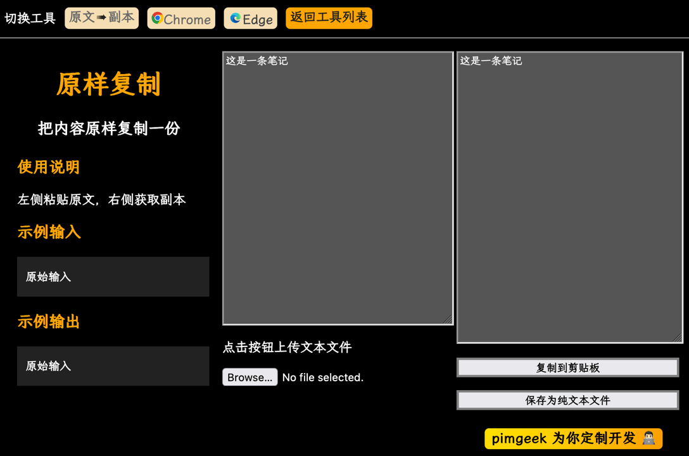
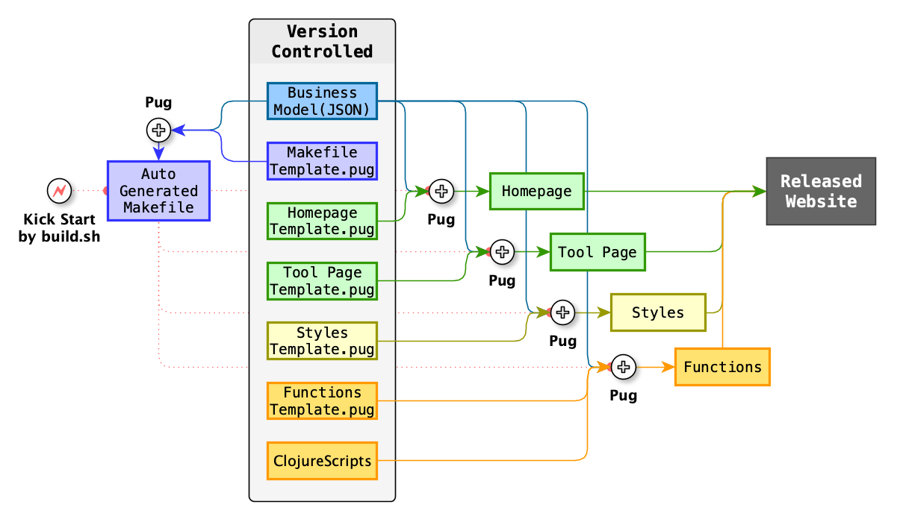

# x2y
## 功能说明

x2y 是一个网页工具生成器，可以利用它创建各式各样的文本格式转换 / 文本加工处理工具。其中 x 代表输入的文本，y 代表输出的文本（或加工处理结果）。

每个生成的工具都带有输入和输出界面，可以手动粘贴或上传文件的方式输入文本，然后把输出的文本存入剪贴板或下载为文本文件。

面向同类处理任务的多个工具会被自动存放在同一个项目文件夹中，形成一个带有索引页的纯前端网站，可以轻松部署在本地电脑或云服务器上，并且可以在主流的网页浏览器（如 Google Chrome / Microsoft Edge / Mozilla Firefox / Apple Safari 等）中使用。

## 需求描述

经常有人需要把笔记转换成别的格式，我自己也有一些日常的数据转换需求，比如大纲层级列表转 Markdown，问答序列转成 Anki 复习卡片专用的 CSV 格式，对输入法的码表做各种统计分析和格式转换处理等等… 于是我就写了这个基于 HTML / CSS / JavaScript 的转换工具套件。

## 构建流程

整个工具集网站的构建流程如下图所示，其中 Business Model 其实是一个 JSON 格式的配置文件，只要修改它就能在网站上显示 / 隐藏某些数据处理功能。具体的数据处理功能是用 ClojureScript 实现的，在发布为静态网站之前会被编译为 JavaScript 代码。

